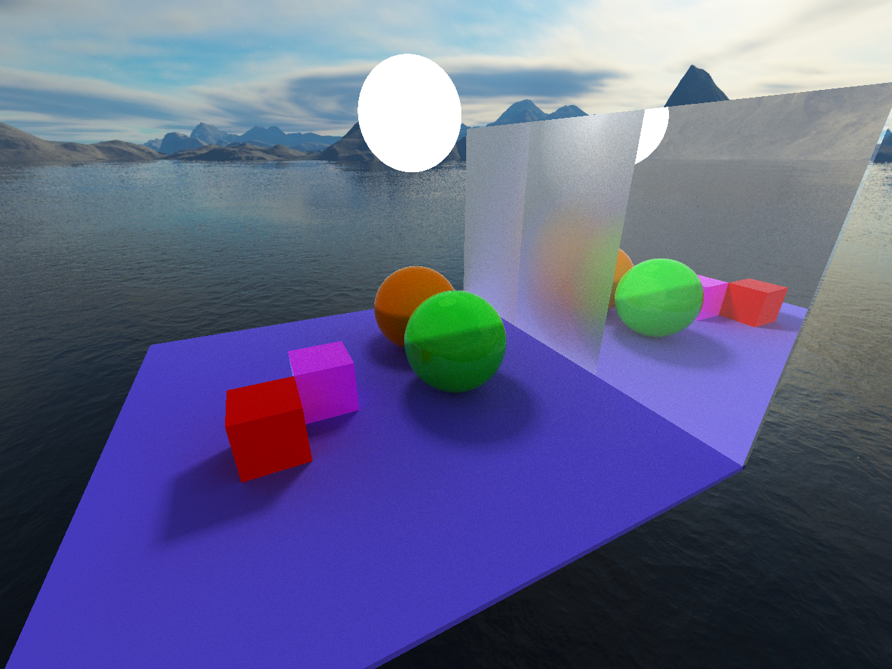
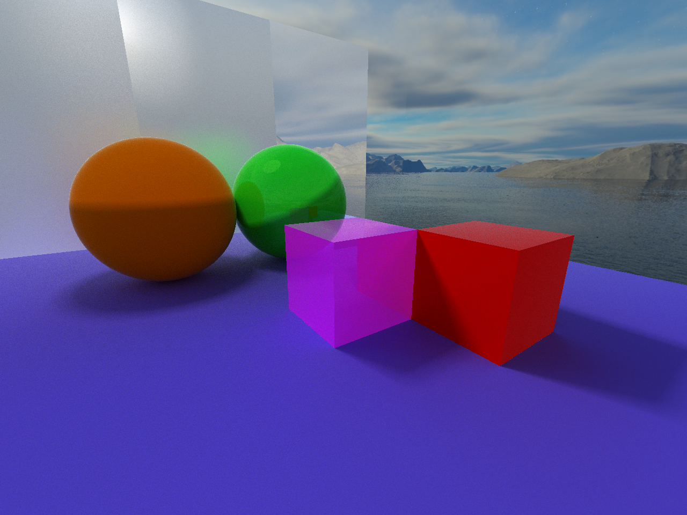
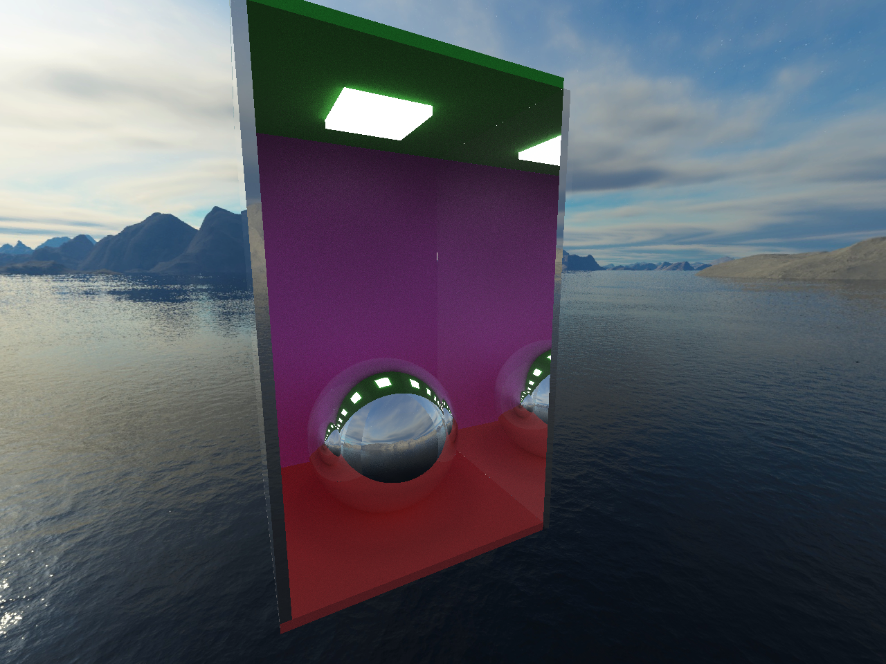
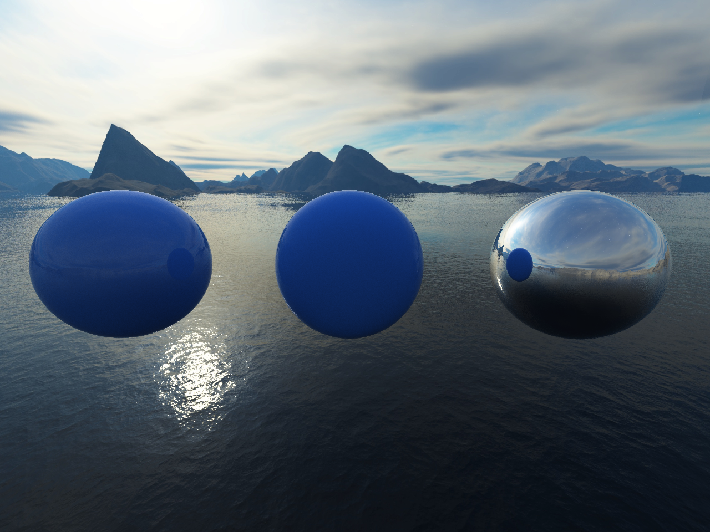

This is the implementation of the ray tracing algorithm on the CPU



# Build
The supported platforms are Windows and Linux. On Linux you need to manually install GLFW 3. After that you can build the program doing

```
make
```

# Usage
You need to run the renderer from the command line providing it the proper arguments:
```
./ray_trace.exe --scene scene_0.txt --threads 16 --init-scale 2
```
This will open a window with the rendered scene. You can more around with WASD and change the camera direction with the mouse.

You should use a number of threads equal to the number of CPU cores. The `--init-scale` lowers the initial resolution of the scene when moving the camera and can be any power of two between 1 and 16 (1, 2, 4, 8, 16).

# Other Pics




